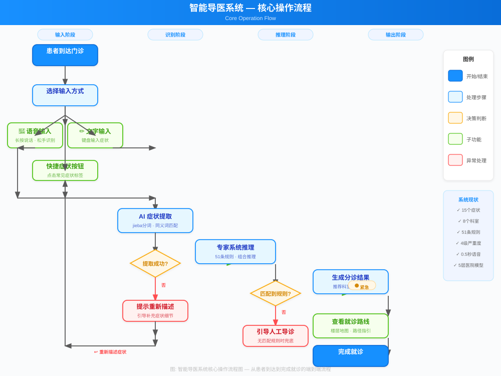
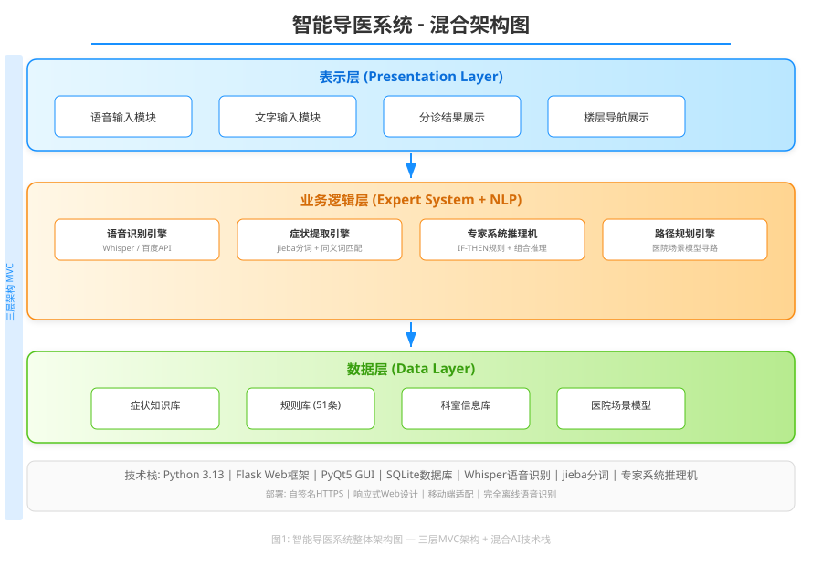
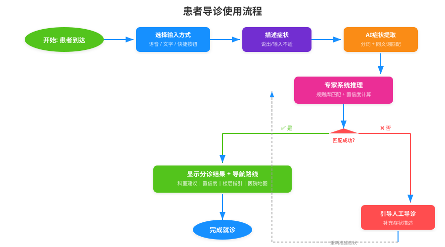
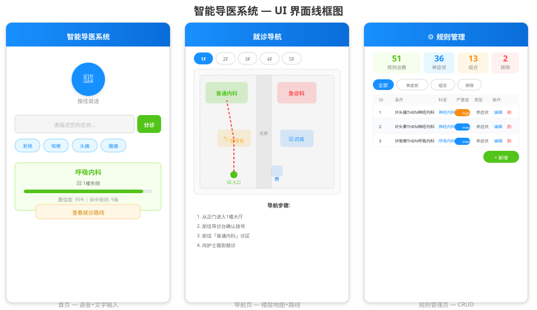
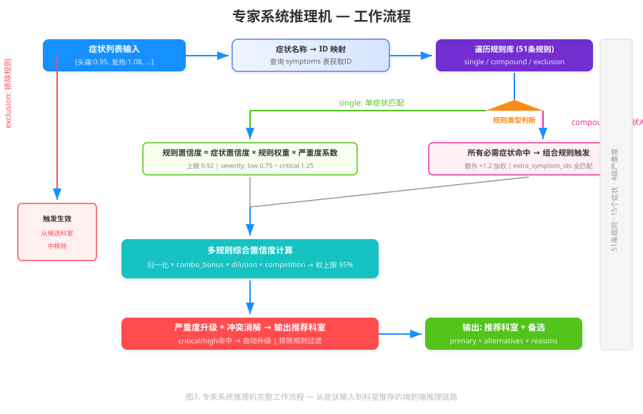
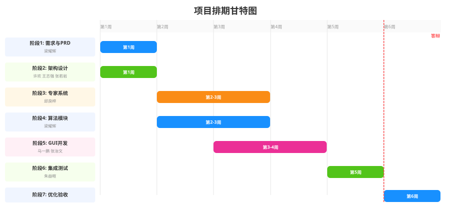

# 智能导医系统产品需求文档(PRD)

**版本**: V1.0  
**撰写日期**: 2026年05月09日  
**产品负责人**: 课程设计小组

---

## 一、项目信息

- **Language**: 中文
- **Programming Language**: Python 3.8+ (专家系统), Java (GUI, 可选)
- **Project Name**: intelligent_medical_guide
- **原始需求复述**: 面向医院门诊场景的AI智能导医原型系统，基于符号主义专家系统规则推理 + 深度学习技术混合架构，为患者提供语音问诊、症状智能识别、自动分诊、科室楼层导航一站式服务。

---

## 二、产品定义

### 核心操作流程

> **图0**: 系统核心操作流程 — 四个阶段（输入→识别→推理→输出），两条异常处理路径（提取失败→重试、无匹配→人工导诊），三条输入通道（语音/文字/快捷按钮）

### 2.1 产品目标 (Product Goals)

1. **核心功能闭环**: 完成可演示的原型系统，支持18种常见症状、10个科室的智能分诊，分诊准确率≥90%，楼层引导路线100%准确
2. **用户体验优化**: 支持语音输入、文字输入双模式，操作流程完整闭环，降低中老年用户操作门槛
3. **系统稳定性保障**: 系统连续运行30分钟无崩溃、无报错，确保课程设计演示的可靠性

### 2.2 用户故事 (User Stories)

1. **作为门诊患者**，我希望通过语音描述症状，以便快速获得准确的科室建议，避免因为医学知识不足导致分诊错误
2. **作为门诊患者**，我希望系统能提供从导诊台到目标科室的详细路线指引，以便减少在医院内寻路的时间
3. **作为医院导诊人员**，我希望系统能辅助我回答患者的常见问题，以便减轻重复咨询的工作压力
4. **作为中老年患者**，我希望可以通过语音与系统交互，而不需要复杂的文字输入，以便更便捷地使用导诊服务
5. **作为医院IT人员**，我希望系统易于维护和更新知识库，以便根据实际需求快速调整系统配置

---

## 三、技术规范

### 3.1 需求池 (Requirements Pool)

#### P0 (必须有)

- **语音问诊模块**: 支持语音输入症状，自动转换为文字（调用语音识别API实现）
- **文字输入模块**: 支持键盘文字输入症状描述（语音识别失败时的备用方案）
- **症状提取模块**: 从输入文本中自动识别核心症状与伴随症状（基于规则匹配 + 文本分类）
- **智能分诊模块**: 基于症状推理给出最优科室建议（专家系统规则库 + 正向推理机）
- **楼层引导模块**: 生成从导诊台到目标科室的详细文字路线（基于科室楼层数据库）
- **多症状综合推理**: 支持同时输入多种症状进行加权分诊（多规则加权计算）
- **异常场景处理**: 识别失败/无匹配症状时给出友好提示，引导至人工导诊

#### P1 (应该有)

- **模糊症状追问**: 症状信息不全时主动提示补充，提升分诊准确率
- **分诊历史记录**: 查看近期分诊记录与就诊建议，便于复诊参考
- **科室信息查询**: 查看各科室简介、出诊医生信息（扩展功能）

#### P2 (可以有)

- **多轮对话式问诊**: 支持与患者进行深入的交互式问诊
- **人脸识别功能**: 增加人脸识别登录/身份验证
- **多语言支持**: 支持方言或少数民族语言
- **对接医院HIS系统**: 实现分诊-挂号一体化

### 3.2 UI设计稿 (UI Design Draft)

#### 系统架构图

> **图1**: 智能导医系统整体架构 — 三层MVC结构，表示层(语音/文字输入+结果展示) → 业务逻辑层(语音识别+症状提取+专家系统+路径规划) → 数据层(症状库+规则库+科室库+医院模型)

#### 用户使用流程

> **图2**: 患者完整使用流程 — 从到达门诊到完成分诊导航的端到端流程，包含匹配失败后的重试机制

#### 核心页面线框图

> **图3**: 三核心页面线框图 — 首页(语音+文字输入+快捷按钮+分诊结果+导航入口) | 导航页(楼层选项卡+医院地图+路径指引) | 规则管理页(规则统计+筛选+表格+CRUD)

#### 专家系统推理流程

> **图4**: 专家系统推理机工作流程 — 症状输入 → ID映射 → 规则遍历(single/compound/exclusion) → 置信度计算 → 严重度升级 → 冲突消解 → 推荐输出

#### 界面设计规范

- **配色方案**: 主色调采用医疗蓝 (#1890FF)，辅助色绿色 (#52C41A)，中性色白色/浅灰
- **字体规范**: 标题使用18-24号加粗，正文使用14-16号，确保老年人可读
- **按钮设计**: 大尺寸圆角按钮，最小点击区域48×48px
- **适配要求**: 适配1080P及以上分辨率，支持门诊自助机大屏显示

### 3.3 非功能需求

#### 性能需求
- 单次分诊响应时间 ≤3秒 (从提交症状到显示分诊结果)
- 语音识别响应时间 ≤2秒 (从松开按钮到显示文字)
- 路线生成响应时间 ≤1秒 (点击查看路线到显示结果)
- 系统稳定性: 连续运行30分钟无崩溃
- 并发支持: 支持单人连续操作无卡顿
- 内存占用: ≤500MB

#### 兼容性需求
- 操作系统: Windows 10及以上版本
- 运行环境: Python 3.8+, JDK 1.8+ (根据技术选型确定)
- 屏幕分辨率: 1920×1080及以上，支持自适应缩放
- 硬件要求: 普通PC即可，需配备麦克风(语音输入用)
- 网络要求: 语音识别需联网，基础分诊功能可离线运行

#### 安全性需求
- 用户隐私: 不存储患者姓名、身份证号等敏感隐私数据
- 数据存储: 分诊历史记录仅本地缓存，不上传云端
- 离线能力: 基础专家系统分诊可离线使用，不依赖网络
- 数据备份: 知识库、规则库定期备份，防止数据丢失
- 访问控制: 管理员配置功能需密码验证，防止误操作

---

## 四、待确认问题 (Open Questions)

1. **技术选型确认**: GUI界面开发是使用Python Tkinter/PyQt还是Java Swing/JavaFX？需要明确技术栈以便后续开发
2. **语音识别API选择**: 使用哪个语音识别API(如百度AI、讯飞、Google等)？需要考虑 accuracy、cost、network dependency
3. **症状库范围**: 初期支持的18种常见症状具体是哪些？需要明确列表以便构建规则库
4. **科室范围**: 系统支持的10个科室具体是哪些？需要明确科室列表及对应的楼层位置信息
5. **医院楼层数据**: 科室楼层数据库是基于真实医院数据还是模拟数据？如果是真实数据，需要获取具体医院的楼层布局图
6. **专家系统规则来源**: 规则库的知识来源是什么(医学指南、专家经验、现有数据库)？需要确保规则的权威性和准确性
7. **演示环境**: 课程设计演示时是使用模拟数据还是连接真实API？需要提前准备演示方案
8. **多症状权重计算**: 多症状综合推理时的权重计算方法需要明确(如 equal weight、expert knowledge、data-driven)
9. **异常处理策略**: 当系统无法识别症状或分诊结果置信度低时，具体的异常处理流程需要细化
10. **扩展性设计**: 未来如果需要扩展症状库和科室数量，系统的架构是否需要重新设计？

---

## 五、项目排期

> **图5**: 项目排期甘特图 — 6周开发周期，7个阶段并行+串行推进，第6周答辩验收

| 阶段 | 时间周期 | 核心任务 | 负责人 | 交付物 |
|------|-----------|----------|--------|--------|
| 阶段1: 需求分析与PRD | 第1周 | 需求调研、撰写PRD、确定开发范围 | 梁耀辉 | PRD文档 |
| 阶段2: 系统架构设计 | 第1周 | 系统架构设计、模块划分、接口定义、数据库设计 | 许欢、王志强、张若岩 | 架构设计文档 |
| 阶段3: 专家系统构建 | 第2-3周 | 医疗知识库构建、规则库编写、推理机实现、测试用例 | 邱良梓 | 专家系统构建文档 |
| 阶段4: 算法模块开发 | 第2-3周 | 语音识别集成、症状提取算法、文本分类实现 | 梁耀辉 | 算法模块开发文档 |
| 阶段5: GUI界面开发 | 第3-4周 | 界面原型设计、各页面开发、交互逻辑实现 | 马一鹏、张治文 | GUI界面开发文档 |
| 阶段6: 系统集成测试 | 第5周 | 模块对接集成、全流程联调、功能测试、BUG修复 | 朱益暄 | 系统集成测试文档 |
| 阶段7: 优化与验收准备 | 第6周 | 系统优化、文档整理、答辩准备 | 全体成员 | 文档、源码 |

---

## 六、风险与应对

| 潜在风险 | 影响程度 | 应对措施 |
|----------|----------|----------|
| 语音识别准确率低 | 中 | 1. 使用成熟大厂API，避免自研；2. 提供文字输入作为备用方案；3. 优化提示语，引导用户清晰描述症状 |
| 专家系统规则覆盖不足 | 中 | 1. 基于提供的18种核心症状构建完整规则；2. 设计兜底规则，未匹配时引导人工导诊；3. 预留规则扩展接口 |
| 多症状分诊冲突 | 低 | 1. 实现加权投票机制；2. 设计冲突消解策略；3. 冲突时给出备选建议而非单一结果 |
| 模块集成困难 | 中 | 1. 提前定义清晰的模块接口；2. 各模块输出标准化数据格式；3. 每周进行一次小型集成验证 |
| 开发进度滞后 | 高 | 1. 制定详细周计划，每日站会同步进度；2. 识别关键路径，优先保障核心功能；3. 预留1周缓冲时间用于赶工 |
| 演示时出现BUG | 中 | 1. 提前进行多轮演示彩排；2. 准备备用演示环境与录屏；3. 设计异常情况下的应对话术 |

---

## 七、备注与补充

- 本项目为课程设计，技术路线限定为 **专家系统(规则推理) + 深度学习(语音/文本分类)** 混合架构，重点验证经典AI与现代深度学习技术的融合应用
- 系统定位为**原型系统**，不要求达到生产级别的稳定性和安全性，但需要确保核心功能的完整性和演示的可靠性
- 建议优先完成P0需求，确保核心功能闭环；在时间和资源允许的情况下，再逐步实现P1和P2需求
- 需要特别注意中老年用户的使用体验，确保界面简洁、操作直观、反馈明确

---

**文档结束**

**组长**: 10523228 梁耀辉  
**组员**: 10523230 朱益暄、10523231 王志强、10523232 许欢、20523233 张若岩、10523234 邱良梓、10523235 张治文、10523237 马一鹏
