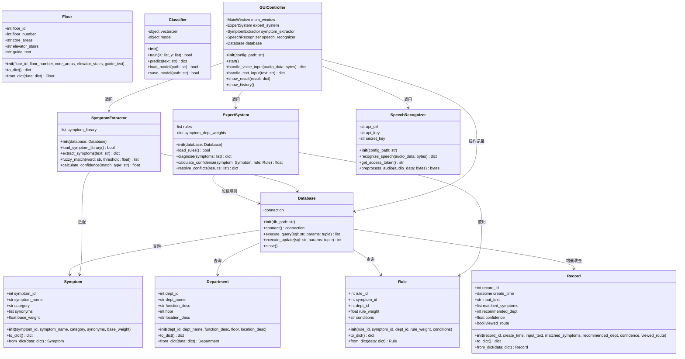
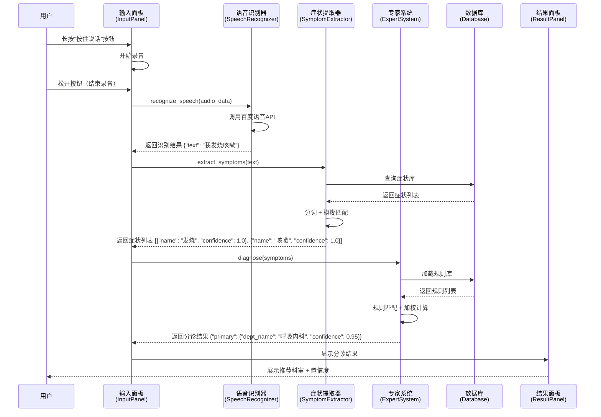
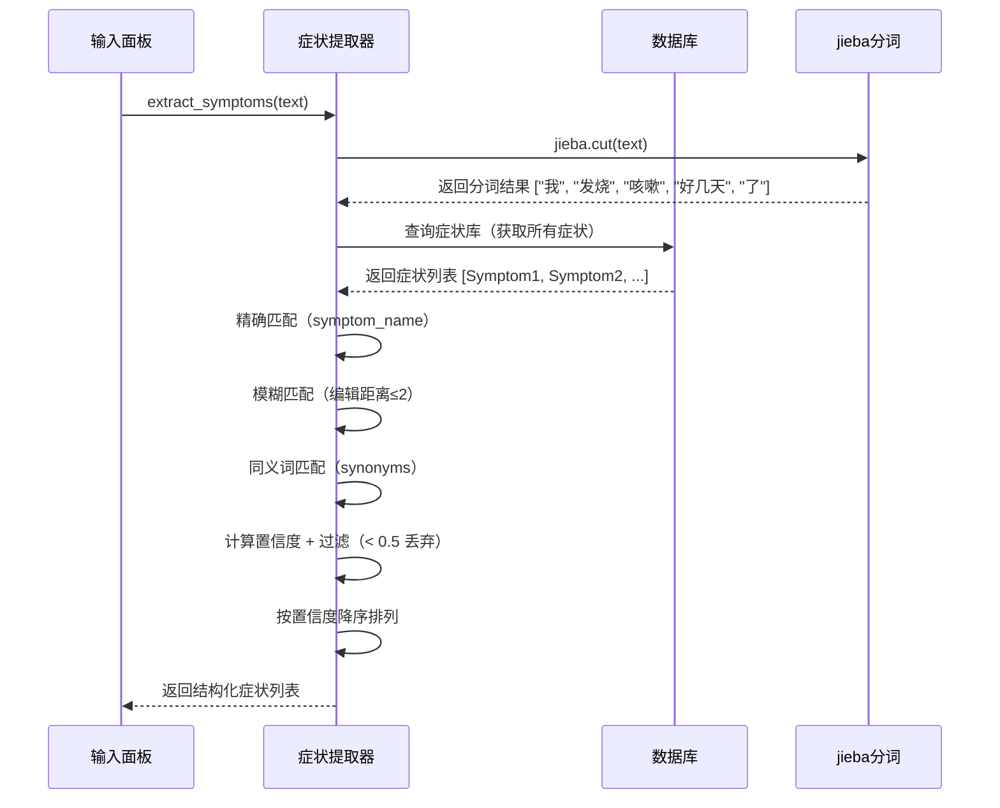
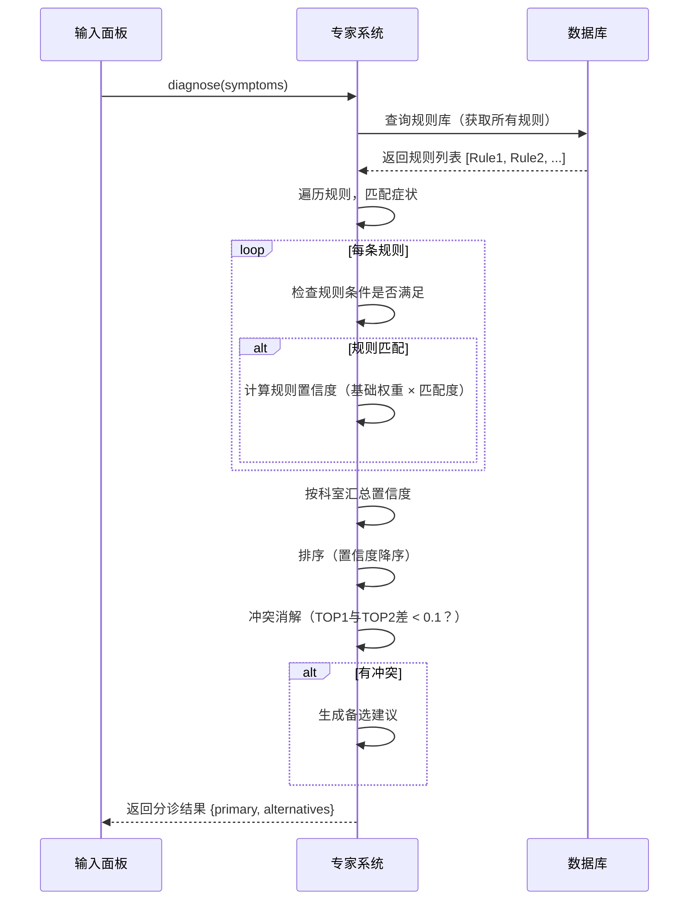
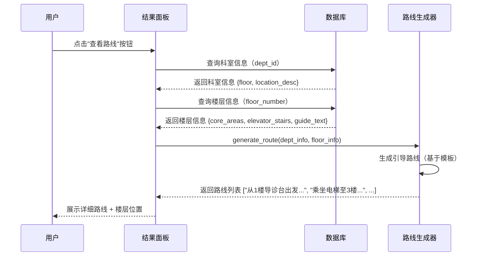
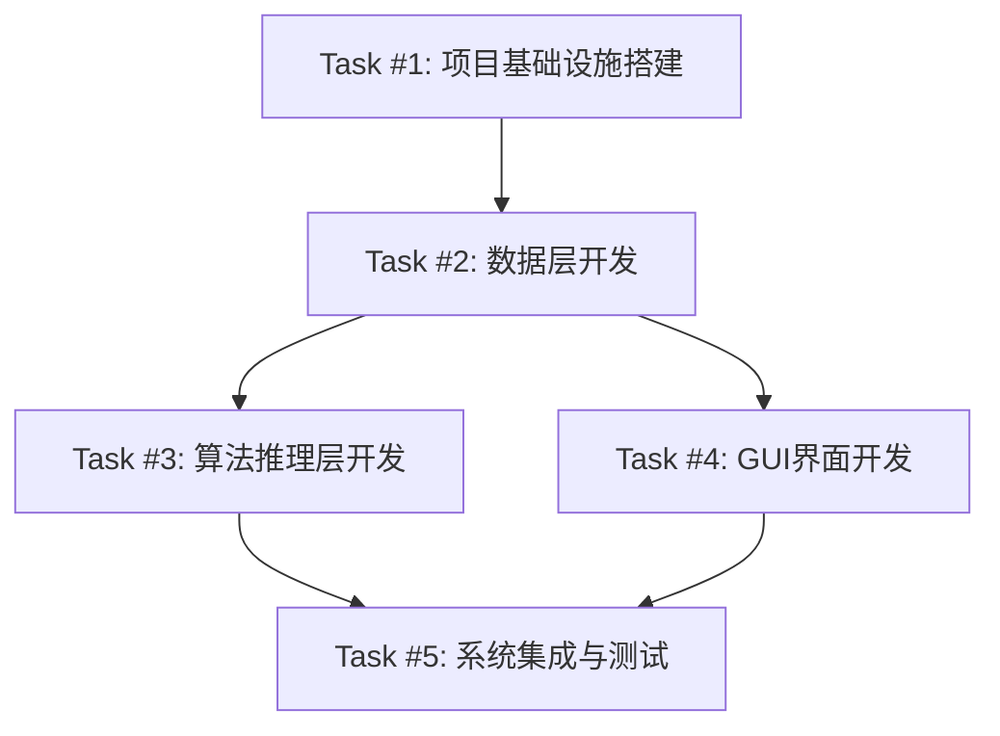

# 智能导医系统任务分解文档

**文档版本：** V1.0  
**撰写日期：** 2026-05-27  
**撰写人：** 高见远（软件架构师）  
**项目名称：** 智能导医系统  

---

## 目录

1. [实现方案与框架选型](#1-实现方案与框架选型)
2. [文件列表及相对路径](#2-文件列表及相对路径)
3. [数据结构和接口（类图）](#3-数据结构和接口)
4. [程序调用流程（时序图）](#4-程序调用流程)
5. [任务列表（有序、含依赖关系）](#5-任务列表)
6. [依赖包列表](#6-依赖包列表)
7. [共享知识（跨文件约定）](#7-共享知识)
8. [待明确事项](#8-待明确事项)

---

## 1. 实现方案与框架选型

### 1.1 技术选型确认

基于PRD需求和架构设计文档，确认以下技术选型：

| 技术领域 | 选型方案 | 版本要求 | 选型理由 |
|---------|---------|---------|---------|
| **编程语言** | Python | 3.8+ | AI生态完善，专家系统与深度学习库丰富，快速原型开发 |
| **GUI框架** | PyQt5 | 5.15.10 | 组件丰富、支持自定义样式、文档齐全，适合桌面级应用 |
| **数据库** | SQLite | 3.35+ | 轻量级、零配置、单文件存储，便于课程设计交付 |
| **语音识别** | 百度语音API | - | 中文识别准确率高、有免费额度、API文档完善 |
| **分词工具** | jieba | 0.42.1 | 中文分词首选、支持自定义词典、社区活跃 |
| **机器学习** | scikit-learn | 1.3.0 | 适合文本分类任务、与专家系统互补、学习曲线平缓 |
| **HTTP库** | requests | 2.31.0 | 调用第三方API（百度语音）的标配库 |

### 1.2 架构设计确认

采用 **四层架构**，各层职责清晰、松耦合：

```
┌─────────────────────────────────────────────────┐
│          交互展示层 (GUI Layer)                  │
│  ├─ 主窗口 (MainWindow)                        │
│  ├─ 输入面板 (InputPanel)                       │
│  ├─ 结果面板 (ResultPanel)                      │
│  └─ 历史面板 (HistoryPanel)                     │
└─────────────────────────────────────────────────┘
                      ↓
┌─────────────────────────────────────────────────┐
│          业务逻辑层 (Business Layer)               │
│  ├─ 分诊流程控制器 (TriageController)           │
│  ├─ 症状管理器 (SymptomManager)                 │
│  ├─ 历史记录器 (HistoryManager)                 │
│  └─ 异常处理中心 (ExceptionHandler)              │
└─────────────────────────────────────────────────┘
                      ↓
┌─────────────────────────────────────────────────┐
│          算法推理层 (Algorithm Layer)             │
│  ├─ 专家系统推理机 (ExpertSystem)               │
│  ├─ 症状提取引擎 (SymptomExtractor)            │
│  ├─ 文本分类器 (Classifier)                     │
│  └─ 语音识别代理 (SpeechRecognizer)             │
└─────────────────────────────────────────────────┘
                      ↓
┌─────────────────────────────────────────────────┐
│          数据层 (Data Layer)                     │
│  ├─ 数据库操作封装 (Database)                   │
│  ├─ 症状模型 (Symptom)                         │
│  ├─ 科室模型 (Department)                       │
│  ├─ 规则模型 (Rule)                            │
│  ├─ 记录模型 (Record)                          │
│  └─ 楼层模型 (Floor)                           │
└─────────────────────────────────────────────────┘
```

### 1.3 方案优势

1. **分层解耦**：各层通过标准接口通信，便于独立开发、测试和维护
2. **混合推理**：符号主义专家系统（可解释性强）+ 深度学习（提升准确率）
3. **离线优先**：核心分诊功能不依赖网络，确保系统可用性
4. **快速原型**：Python + PyQt5 组合可快速实现演示原型
5. **易扩展**：规则库、症状库、科室数据均支持动态加载

---

## 2. 文件列表及相对路径

### 2.1 文件目录结构

```
guide_system/
├── main.py                  # 程序入口，初始化系统并启动GUI
├── config.ini              # 配置文件（API密钥、系统参数）
├── requirements.txt        # Python依赖清单
├── init_db.py             # 数据库初始化脚本（建表 + 导入初始数据）
├── guide_system.db        # SQLite数据库文件（运行时自动生成）
│
├── core/                   # 核心算法层
│   ├── __init__.py
│   ├── expert_system.py   # 专家系统推理机（规则匹配 + 加权计算）
│   ├── symptom_extractor.py # 症状提取引擎（分词 + 模糊匹配）
│   ├── classifier.py      # 深度学习分类器（辅助症状识别）
│   └── speech_recognition.py # 语音识别代理（封装百度API）
│
├── gui/                    # 交互展示层
│   ├── __init__.py
│   ├── main_window.py     # 主窗口（布局管理 + 面板切换）
│   ├── input_panel.py     # 输入面板（语音按钮 + 文字输入 + 快捷症状）
│   ├── result_panel.py    # 结果展示面板（分诊建议 + 置信度）
│   └── history_panel.py   # 历史记录面板（记录列表 + 详情查看）
│
├── models/                 # 数据模型层
│   ├── __init__.py
│   ├── database.py        # 数据库操作封装（连接 + 增删改查）
│   ├── symptom.py         # 症状数据模型（对应symptoms表）
│   ├── department.py      # 科室数据模型（对应departments表）
│   ├── rule.py            # 规则数据模型（对应rules表）
│   └── record.py          # 记录数据模型（对应records表）
│
├── data/                   # 数据文件（JSON格式，用于初始化数据库）
│   ├── symptoms.json      # 症状知识库（18种核心症状）
│   ├── rules.json         # 分诊规则库（IF-THEN规则集）
│   └── departments.json   # 科室数据（10个科室 + 楼层信息）
│
└── utils/                  # 工具模块
    ├── __init__.py
    ├── logger.py          # 日志工具（分级记录 + 文件输出）
    └── helpers.py         # 通用辅助函数（数据格式化、异常处理等）
```

### 2.2 文件用途说明

| 文件路径 | 用途 | 所属层次 |
|---------|------|---------|
| `main.py` | 程序入口，初始化系统并启动GUI | 入口 |
| `config.ini` | 存储API密钥、系统配置参数 | 配置 |
| `requirements.txt` | 列出所有Python依赖包及版本 | 配置 |
| `init_db.py` | 创建数据库表 + 导入初始数据 | 数据层 |
| `guide_system.db` | SQLite数据库文件 | 数据层 |
| `core/expert_system.py` | 专家系统推理机，核心分诊算法 | 算法层 |
| `core/symptom_extractor.py` | 症状提取引擎，从文本中识别症状 | 算法层 |
| `core/classifier.py` | 深度学习文本分类器（辅助） | 算法层 |
| `core/speech_recognition.py` | 语音识别代理，调用百度API | 算法层 |
| `gui/main_window.py` | 主窗口，管理各面板布局与切换 | 展示层 |
| `gui/input_panel.py` | 输入面板，提供语音/文字输入界面 | 展示层 |
| `gui/result_panel.py` | 结果展示面板，显示分诊建议 | 展示层 |
| `gui/history_panel.py` | 历史记录面板，展示分诊历史 | 展示层 |
| `models/database.py` | 数据库操作封装，提供CRUD接口 | 数据层 |
| `models/symptom.py` | 症状数据模型，封装symptoms表操作 | 数据层 |
| `models/department.py` | 科室数据模型，封装departments表操作 | 数据层 |
| `models/rule.py` | 规则数据模型，封装rules表操作 | 数据层 |
| `models/record.py` | 记录数据模型，封装records表操作 | 数据层 |
| `data/symptoms.json` | 症状知识库初始数据 | 数据文件 |
| `data/rules.json` | 分诊规则库初始数据 | 数据文件 |
| `data/departments.json` | 科室数据初始数据 | 数据文件 |
| `utils/logger.py` | 日志工具，记录系统运行日志 | 工具 |
| `utils/helpers.py` | 通用辅助函数 | 工具 |

---

## 3. 数据结构和接口

### 3.1 核心数据模型（类图）



### 3.2 核心接口定义

#### 3.2.1 专家系统接口（ExpertSystem）

```python
class ExpertSystem:
    """专家系统推理机"""
    
    def __init__(self, database: Database):
        """
        初始化专家系统
        
        Args:
            database: Database对象，用于加载规则库
        """
        pass
    
    def load_rules(self) -> bool:
        """
        从数据库加载所有规则
        
        Returns:
            bool: 加载成功返回True，否则返回False
        """
        pass
    
    def diagnose(self, symptoms: list) -> dict:
        """
        基于症状列表进行智能分诊
        
        Args:
            symptoms: 症状列表，格式为 [{"name": str, "confidence": float}]
            
        Returns:
            {
                "success": True,
                "data": {
                    "primary": {
                        "dept_id": int,
                        "dept_name": str,
                        "confidence": float,
                        "reason": str
                    },
                    "alternatives": [{"dept_id": int, "dept_name": str, "confidence": float}],
                    "matched_rules": list
                },
                "message": str
            }
        """
        pass
    
    def calculate_confidence(self, symptom: Symptom, rule: Rule) -> float:
        """
        计算单条规则的置信度
        
        Args:
            symptom: Symptom对象
            rule: Rule对象
            
        Returns:
            float: 置信度 (0.0 ~ 1.0)
        """
        pass
    
    def _resolve_conflicts(self, results: list) -> dict:
        """
        解决多科室冲突（加权投票机制）
        
        Args:
            results: 匹配结果列表
            
        Returns:
            dict: 最优科室建议 + 备选科室
        """
        pass
```

#### 3.2.2 症状提取器接口（SymptomExtractor）

```python
class SymptomExtractor:
    """症状提取引擎"""
    
    def __init__(self, database: Database):
        """
        初始化症状提取器
        
        Args:
            database: Database对象，用于加载症状库
        """
        pass
    
    def load_symptom_library(self) -> bool:
        """
        从数据库加载症状库
        
        Returns:
            bool: 加载成功返回True，否则返回False
        """
        pass
    
    def extract_symptoms(self, text: str) -> dict:
        """
        从文本中提取症状关键词
        
        Args:
            text: 用户输入的自然语言文本
            
        Returns:
            {
                "success": True,
                "data": {
                    "symptoms": [
                        {"name": str, "type": str, "confidence": float}
                    ],
                    "need_clarify": bool,
                    "clarify_question": str
                },
                "message": str
            }
        """
        pass
    
    def fuzzy_match(self, word: str, threshold: float = 0.8) -> list:
        """
        模糊匹配症状库
        
        Args:
            word: 待匹配词
            threshold: 相似度阈值
            
        Returns:
            list: 匹配到的症状列表 [{symptom, confidence}]
        """
        pass
```

#### 3.2.3 语音识别器接口（SpeechRecognizer）

```python
class SpeechRecognizer:
    """语音识别代理"""
    
    def __init__(self, config_path: str):
        """
        初始化语音识别器
        
        Args:
            config_path: 配置文件路径（包含API密钥）
        """
        pass
    
    def recognize_speech(self, audio_data: bytes) -> dict:
        """
        将音频数据转换为文字
        
        Args:
            audio_data: 音频二进制数据（PCM格式，16000Hz）
            
        Returns:
            {
                "success": True,
                "data": {"text": str},
                "message": str
            }
        """
        pass
    
    def get_access_token(self) -> str:
        """
        获取百度API访问令牌
        
        Returns:
            str: 访问令牌
        """
        pass
```

#### 3.2.4 GUI控制器接口（GUIController）

```python
class GUIController:
    """GUI控制器（主窗口逻辑）"""
    
    def __init__(self, config_path: str = "config.ini"):
        """
        初始化GUI控制器
        
        Args:
            config_path: 配置文件路径
        """
        pass
    
    def start(self):
        """启动GUI主循环"""
        pass
    
    def handle_voice_input(self, audio_data: bytes) -> dict:
        """
        处理语音输入
        
        Args:
            audio_data: 音频数据
            
        Returns:
            dict: 处理结果
        """
        pass
    
    def handle_text_input(self, text: str) -> dict:
        """
        处理文字输入
        
        Args:
            text: 用户输入的文本
            
        Returns:
            dict: 处理结果
        """
        pass
```

---

## 4. 程序调用流程

### 4.1 语音问诊流程（时序图）



### 4.2 症状提取流程（时序图）



### 4.3 智能分诊流程（时序图）



### 4.4 楼层引导流程（时序图）



---

## 5. 任务列表

### 5.1 任务分解原则

1. **依赖优先**：按依赖关系排序，无依赖任务优先
2. **模块分组**：相关功能打包为一个任务，减少任务数量
3. **可测试性**：每个任务完成后可独立测试
4. **并行开发**：无依赖关系的任务可并行开发

### 5.2 任务列表（有序）

#### Task #1: 项目基础设施搭建
- **依赖**：无
- **涉及文件**：
  - `main.py`（程序入口）
  - `config.ini`（配置文件）
  - `requirements.txt`（依赖清单）
  - `guide_system/`（项目目录结构）
- **描述**：
  1. 创建项目目录结构
  2. 编写`requirements.txt`（列出所有依赖包）
  3. 编写`config.ini`模板（API密钥、系统参数）
  4. 编写`main.py`框架（初始化GUI、加载配置）
- **预估工作量**：2小时
- **优先级**：P0（必须有）

---

#### Task #2: 数据层开发（数据库 + 数据模型）
- **依赖**：Task #1
- **涉及文件**：
  - `init_db.py`（数据库初始化脚本）
  - `models/database.py`（数据库操作封装）
  - `models/symptom.py`（症状模型）
  - `models/department.py`（科室模型）
  - `models/rule.py`（规则模型）
  - `models/record.py`（记录模型）
  - `data/symptoms.json`（症状初始数据）
  - `data/rules.json`（规则初始数据）
  - `data/departments.json`（科室初始数据）
- **描述**：
  1. 设计数据库表结构（symptoms, departments, rules, records, floors）
  2. 编写`init_db.py`（建表 + 导入JSON初始数据）
  3. 编写`models/database.py`（封装SQLite连接、查询、更新）
  4. 编写数据模型类（Symptom, Department, Rule, Record, Floor）
  5. 准备初始数据JSON文件（18种症状、10个科室、基础规则）
- **预估工作量**：6小时
- **优先级**：P0（必须有）
- **验收标准**：运行`init_db.py`后，数据库文件生成且表结构正确，初始数据导入成功。

---

#### Task #3: 算法推理层开发（核心AI模块）
- **依赖**：Task #2
- **涉及文件**：
  - `core/expert_system.py`（专家系统推理机）
  - `core/symptom_extractor.py`（症状提取引擎）
  - `core/classifier.py`（深度学习分类器）
  - `core/speech_recognition.py`（语音识别代理）
  - `utils/helpers.py`（辅助函数）
- **描述**：
  1. 编写`core/expert_system.py`：
     - 实现规则加载（`load_rules`）
     - 实现正向推理机（`diagnose`）
     - 实现加权计算（`calculate_confidence`）
     - 实现冲突消解（`_resolve_conflicts`）
  2. 编写`core/symptom_extractor.py`：
     - 实现症状库加载（`load_symptom_library`）
     - 实现分词 + 精确/模糊/同义词匹配（`extract_symptoms`）
     - 实现置信度计算
  3. 编写`core/classifier.py`：
     - 实现文本向量化（TF-IDF）
     - 实现朴素贝叶斯/SVM分类器（`train`, `predict`）
  4. 编写`core/speech_recognition.py`：
     - 封装百度语音API调用（`recognize_speech`）
     - 实现音频预处理（`preprocess_audio`）
- **预估工作量**：10小时
- **优先级**：P0（必须有）
- **验收标准**：
  1. 输入"发烧咳嗽"，专家系统能正确推荐"呼吸内科"
  2. 语音识别模块能正确调用百度API并返回文字
  3. 症状提取模块能从文本中正确提取症状关键词

---

#### Task #4: GUI界面开发（交互展示层）
- **依赖**：Task #2, Task #3
- **涉及文件**：
  - `gui/main_window.py`（主窗口）
  - `gui/input_panel.py`（输入面板）
  - `gui/result_panel.py`（结果展示面板）
  - `gui/history_panel.py`（历史记录面板）
  - `utils/logger.py`（日志工具）
- **描述**：
  1. 编写`gui/main_window.py`：
     - 使用PyQt5创建主窗口
     - 实现面板切换（输入面板 ↔ 结果面板 ↔ 历史面板）
  2. 编写`gui/input_panel.py`：
     - 实现语音按钮（按下录音、松开识别）
     - 实现文字输入框 + 确认按钮
     - 实现快捷症状按钮（发烧、咳嗽等）
  3. 编写`gui/result_panel.py`：
     - 展示分诊结果（科室名称、置信度、分诊依据）
     - 实现"查看路线"按钮
  4. 编写`gui/history_panel.py`：
     - 展示分诊历史记录列表
     - 实现记录详情查看
  5. 编写`utils/logger.py`：
     - 实现分级日志（DEBUG/INFO/WARNING/ERROR）
     - 实现日志文件输出
- **预估工作量**：12小时
- **优先级**：P0（必须有）
- **验收标准**：
  1. 界面布局符合PRD设计规范（医疗蓝主色调、大按钮）
  2. 语音按钮能正常录音并调用识别API
  3. 分诊结果能正确展示

---

#### Task #5: 系统集成与测试
- **依赖**：Task #3, Task #4
- **涉及文件**：
  - `main.py`（修改：集成各模块）
  - `gui/main_window.py`（修改：连接业务逻辑）
  - `test_*.py`（测试用例，如`test_expert_system.py`, `test_symptom_extractor.py`）
- **描述**：
  1. 修改`main.py`，集成所有模块（GUI + 算法 + 数据层）
  2. 实现完整的"输入 → 提取 → 推理 → 展示"流程
  3. 编写单元测试：
     - 测试专家系统推理（`test_expert_system.py`）
     - 测试症状提取（`test_symptom_extractor.py`）
     - 测试数据库操作（`test_database.py`）
  4. 进行系统集成测试：
     - 测试语音输入流程
     - 测试文字输入流程
     - 测试历史记录功能
     - 测试异常处理（识别失败、无匹配症状等）
  5. 优化性能（确保分诊响应时间 ≤ 3秒）
- **预估工作量**：8小时
- **优先级**：P0（必须有）
- **验收标准**：
  1. 系统能完整运行演示流程（语音输入 → 分诊 → 查看路线）
  2. 所有单元测试通过
  3. 性能满足非功能需求（响应时间、内存占用）

---

### 5.3 任务依赖关系图



### 5.4 任务分配建议

| 任务编号 | 任务名称 | 建议负责人 | 备注 |
|---------|---------|---------|------|
| Task #1 | 项目基础设施搭建 | 梁耀辉（组长） | 全局协调 |
| Task #2 | 数据层开发 | 邱良梓（专家系统组） | 需准备医学知识库 |
| Task #3 | 算法推理层开发 | 梁耀辉（算法组） | 核心AI模块 |
| Task #4 | GUI界面开发 | 马一鹏、张治文（界面组） | 并行开发 |
| Task #5 | 系统集成与测试 | 朱益暄（测试组） | 需全员配合 |

---

## 6. 依赖包列表

### 6.1 Python依赖包

```
# 核心依赖
PyQt5==5.15.10          # GUI框架
jieba==0.42.1            # 中文分词
scikit-learn==1.3.0      # 机器学习（文本分类）
requests==2.31.0         # HTTP库（调用百度API）
numpy==1.24.3            # 数值计算（scikit-learn依赖）

# 内置模块（无需安装）
sqlite3                   # 数据库（Python内置）
json                      # JSON处理（Python内置）
datetime                  # 时间处理（Python内置）
os                        # 文件系统操作（Python内置）
```

### 6.2 第三方服务

| 服务名称 | 用途 | 费用 | 申请方式 |
|---------|------|------|---------|
| 百度语音识别API | 语音转文字 | 免费额度：50000次/天 | 官网注册：https://ai.baidu.com/ |
| （备选）讯飞语音API | 语音转文字 | 免费额度：200次/天 | 官网注册：https://www.xfyun.cn/ |

### 6.3 开发工具

| 工具名称 | 用途 | 版本要求 |
|---------|------|---------|
| Python | 编程语言 | 3.8+ |
| pip | 包管理工具 | 21.0+ |
| Git | 版本控制 | 2.30+ |
| PyCharm / VSCode | IDE | 最新版 |

---

## 7. 共享知识

### 7.1 编码规范

遵循 **PEP 8** 编码规范，具体要求：

1. **缩进**：使用4个空格（禁止使用Tab）
2. **命名约定**：
   - 类名：大驼峰命名法（`ExpertSystem`, `SymptomExtractor`）
   - 函数名/方法名：小写 + 下划线（`extract_symptoms`, `calculate_confidence`）
   - 常量：全大写 + 下划线（`MAX_CONFIDENCE`, `DEFAULT_THRESHOLD`）
   - 私有方法：前缀下划线（`_resolve_conflicts`, `_preprocess_audio`）
3. **注释规范**：
   - 每个类、公共方法必须写docstring（使用Google风格）
   - 复杂逻辑必须写行内注释
4. **文件编码**：统一使用UTF-8

**示例**：

```python
class ExpertSystem:
    """专家系统推理机（符号主义规则推理）"""
    
    def __init__(self, database: Database):
        """
        初始化专家系统
        
        Args:
            database: Database对象，用于加载规则库
            
        Raises:
            ValueError: 如果database为None
        """
        if database is None:
            raise ValueError("database cannot be None")
        self.database = database
        self.rules = []
    
    def diagnose(self, symptoms: list) -> dict:
        """
        基于症状列表进行智能分诊
        
        Args:
            symptoms: 症状列表，格式为 [{"name": str, "confidence": float}]
            
        Returns:
            dict: 包含分诊结果的字典
            
        Example:
            >>> es = ExpertSystem(db)
            >>> result = es.diagnose([{"name": "发烧", "confidence": 1.0}])
            >>> print(result["data"]["primary"]["dept_name"])
            "呼吸内科"
        """
        pass
```

### 7.2 错误处理策略

1. **统一返回格式**：
   ```python
   {
       "success": True/False,
       "data": any,       # 成功时返回数据
       "message": str     # 失败时返回错误信息
   }
   ```

2. **异常处理**：
   - 捕获所有异常，禁止直接抛出给GUI（避免程序崩溃）
   - 记录异常日志（使用`utils/logger.py`）
   - 返回友好的用户提示（如"网络连接异常，请检查网络"）

3. **常见异常场景**：
   - 数据库查询失败 → 返回"系统错误，请重启程序"
   - 语音识别API调用失败 → 返回"识别失败，请使用文字输入"
   - 症状提取无匹配 → 返回"未识别到有效症状，请详细描述"

### 7.3 日志规范

使用`utils/logger.py`统一记录日志：

```python
# 日志级别
DEBUG    # 详细调试信息（开发时使用）
INFO     # 常规运行信息（如"用户点击分诊按钮"）
WARNING   # 警告信息（如"规则库为空"）
ERROR     # 错误信息（如"数据库连接失败"）

# 日志格式
[2026-05-27 14:30:25] [INFO] [ExpertSystem.diagnose] 开始分诊，症状列表：['发烧', '咳嗽']
[2026-05-27 14:30:26] [ERROR] [Database.connect] 数据库连接失败：磁盘空间不足
```

### 7.4 数据库操作规范

1. **连接管理**：
   - 使用`models/database.py`统一封装数据库连接
   - 禁止在业务代码中直接写SQL（防止SQL注入）
   - 使用参数化查询（`?`占位符）

2. **事务处理**：
   - 新增/修改/删除操作必须使用事务
   - 操作失败后回滚

3. **初始化数据**：
   - 所有初始数据放在`data/*.json`文件中
   - 运行`init_db.py`时自动导入

### 7.5 GUI开发规范

1. **布局管理**：
   - 使用PyQt5的布局管理器（QVBoxLayout, QHBoxLayout等）
   - 禁止硬编码像素值（使用自适应布局）

2. **线程安全**：
   - 语音识别、数据库操作等耗时任务必须放在子线程（QThread）
   - 禁止在GUI主线程执行耗时操作（避免界面卡顿）

3. **样式管理**：
   - 使用QSS（类似CSS）统一管理样式
   - 主色调：`#1890FF`（医疗蓝），辅助色：`#52C41A`（绿色）

---

## 8. 待明确事项

### 8.1 需要用户确认的技术决策

| 序号 | 待确认问题 | 当前建议 | 影响范围 |
|-----|-----------|---------|---------|
| 1 | **GUI框架最终选择**：PyQt5 还是 Tkinter？ | PyQt5（界面更美观） | 整个GUI层 |
| 2 | **语音识别API选择**：百度API 还是 讯飞API？ | 百度API（免费额度更高） | 语音识别模块 |
| 3 | **18种核心症状具体是哪些**？ | 需医学专业同学提供 | 症状库、规则库 |
| 4 | **10个科室具体是哪些**？ | 需明确列表及楼层位置 | 科室表、楼层表 |
| 5 | **规则库的知识来源**？ | 基于医学指南 + 专家经验 | 规则库准确性 |
| 6 | **演示时是使用模拟数据还是连接真实API**？ | 建议准备模拟数据（防止演示时网络异常） | 演示可靠性 |

### 8.2 架构风险点

| 风险点 | 影响程度 | 应对措施 |
|-------|---------|---------|
| **语音识别准确率低** | 中 | 1. 使用成熟大厂API；2. 提供文字输入作为备用；3. 优化提示语 |
| **专家系统规则覆盖不足** | 中 | 1. 基于18种核心症状构建完整规则；2. 设计兜底规则（未匹配时引导人工导诊） |
| **多症状分诊冲突** | 低 | 1. 实现加权投票机制；2. 冲突时给出备选建议 |
| **模块集成困难** | 中 | 1. 提前定义清晰的模块接口；2. 每周进行一次小型集成验证 |
| **开发进度滞后** | 高 | 1. 制定详细周计划；2. 优先保障核心功能（P0需求） |
| **演示时出现BUG** | 中 | 1. 提前进行多轮演示彩排；2. 准备备用演示环境 |

### 8.3 扩展性设计建议

1. **规则库热加载**：
   - 当前方案：启动时加载规则库
   - 改进方案：支持运行时动态加载新规则（无需重启系统）

2. **多语言支持**：
   - 当前方案：仅支持中文
   - 改进方案：使用国际化框架（如`gettext`）支持多语言

3. **对接医院HIS系统**：
   - 当前方案：独立运行
   - 改进方案：预留HIS系统对接接口（实现分诊-挂号一体化）

---

## 9. 附录

### 9.1 开发时间表（建议）

| 阶段 | 时间 | 核心任务 | 交付物 |
|-----|------|---------|--------|
| 第1周 | 第1-7天 | Task #1 + Task #2 | 项目框架 + 数据库 |
| 第2周 | 第8-14天 | Task #3 | 算法模块 |
| 第3周 | 第15-21天 | Task #4 | GUI界面 |
| 第4周 | 第22-28天 | Task #5 + 优化 | 完整系统 + 测试报告 |
| 第5周 | 第29-35天 | 答辩准备 | 演示PPT + 文档 |

### 9.2 文档交付清单

1. `PRD完整版.md`（产品需求文档）✅
2. `智能导医系统架构设计.md`（架构设计文档）✅
3. `任务分解.md`（本文档，任务分解）✅
4. `guide_system/`（源代码）
5. `测试报告.md`
6. `用户手册.md`
7. `答辩PPT.pptx`

---

**文档结束**

**撰写人**：高见远（软件架构师）  
**审核人**：待定  
**批准人**：待定  

---

*本文档为智能导医系统课程设计任务分解文档，基于PRD和架构设计文档编写，用于指导后续开发工作。*
