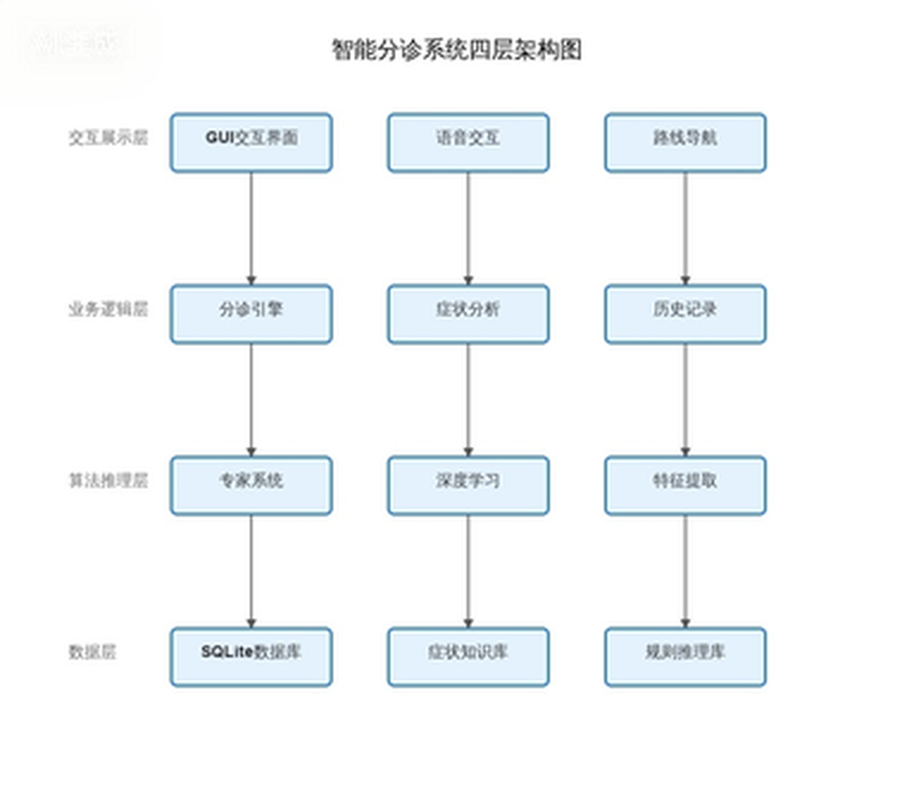
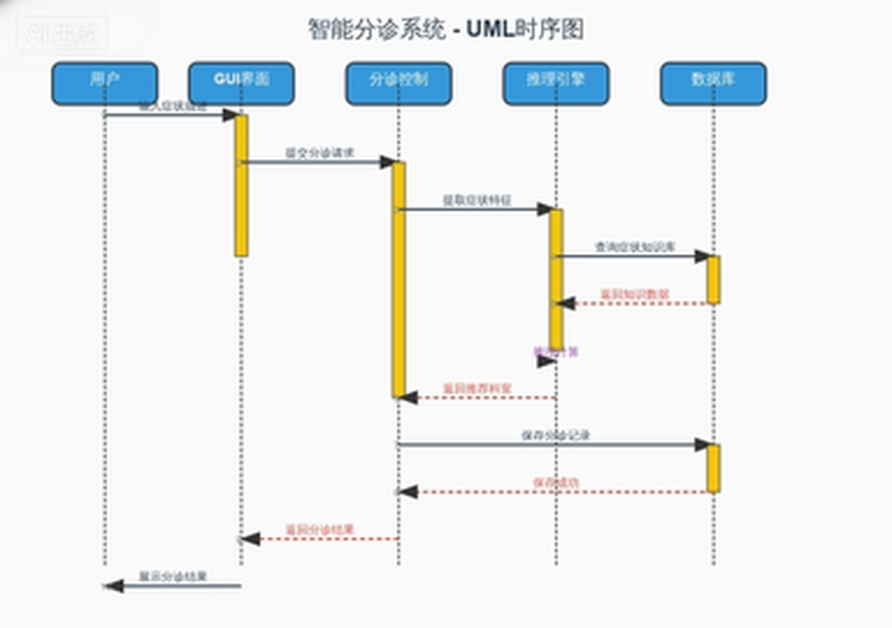
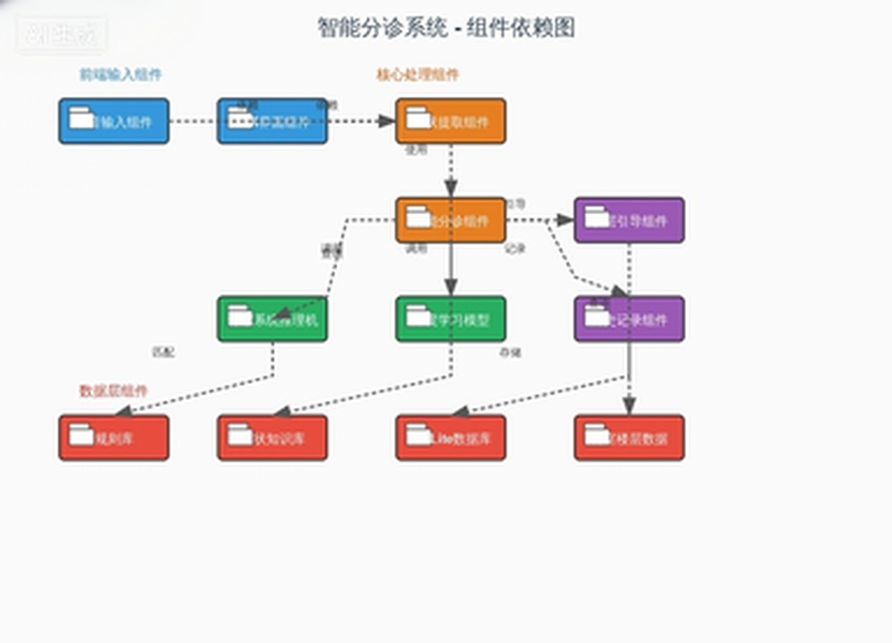
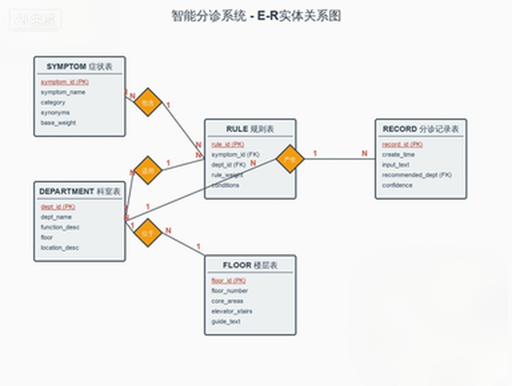

# 智能导医系统架构设计文档

**文档版本：** V1.0  
**修订日期：** 2026-05-26  
**产品名称：** 智能导医系统  
**撰写人：** 课程设计小组  

---

## 目录

1. [项目概述](#1-项目概述)
2. [需求分析](#2-需求分析)
3. [系统总体架构](#3-系统总体架构)
4. [功能模块设计](#4-功能模块设计)
5. [技术选型](#5-技术选型)
6. [数据库设计](#6-数据库设计)
7. [核心接口设计](#7-核心接口设计)
8. [部署架构](#8-部署架构)
9. [风险与扩展性](#9-风险与扩展性)

---

## 1. 项目概述

### 1.1 项目背景

当前医院就诊流程繁琐，人工导诊人员工作压力大，患者常因不熟悉科室布局、不清楚症状对应科室，出现分诊错误、就诊延误等问题。据统计，85%的首诊患者不知该挂何科室，平均候诊时间达1.8小时。大型医院楼层多、科室分散，院内导航困难，信息不对称问题突出。

在"健康中国2030"战略推进与老龄化加剧的背景下，智慧医疗市场规模预计在2025年达300亿元，年复合增长率35%。《互联网诊疗管理办法》等政策的出台，为智能导医类产品提供了广阔的发展空间。

### 1.2 产品定位

面向医院门诊场景的 **AI 智能导医原型系统**，基于**符号主义专家系统规则推理 + 深度学习技术混合架构**，为患者提供**语音问诊、症状智能识别、自动分诊、科室楼层导航**一站式服务，替代/辅助人工导诊，简化就诊流程，提升医院门诊服务效率。

### 1.3 核心目标

| 目标维度 | 短期目标 | 长期目标 |
|---------|---------|---------|
| 功能范围 | 支持18种常见症状、10个科室智能分诊 | 扩展症状库至50+种，支持多轮对话式问诊 |
| 分诊准确率 | ≥ 90% | ≥ 95% |
| 导航准确率 | 楼层引导路线100%准确 | 支持AR实景导航 |
| 交互方式 | 语音输入、文字输入双模式 | 增加人脸识别、多语言支持 |
| 稳定性 | 连续运行30分钟无崩溃 | 对接医院HIS挂号系统，实现分诊-挂号一体化 |

### 1.4 核心价值

**患者端价值：**
- **快速分诊**：AI自动匹配科室，避免因医学知识不足导致的分诊错误
- **精准导航**：明确科室位置与就诊路线，减少寻路时间
- **便捷操作**：支持语音输入，降低中老年用户操作门槛
- **减少等待**：自助导诊无需排队，提升就诊体验

**医院端价值：**
- **降本增效**：减轻人工导诊人员工作压力，降低人力成本
- **提升流转**：优化门诊就诊流程，提升患者流转效率
- **服务升级**：智能化服务提升医院整体形象与患者满意度

**教学价值：**
- 验证经典AI（专家系统）与现代深度学习技术在医疗场景的融合应用
- 通过完整产品开发流程，提升团队工程实践与协作能力

### 1.5 适用场景

1. **首次就医场景**：患者首次到院，不了解医院科室设置
2. **多症状复杂场景**：患者同时出现多种症状，无法判断优先就诊科室
3. **寻路导航场景**：患者已知就诊科室，但找不到具体楼层与位置
4. **高峰繁忙场景**：门诊高峰时段人工导诊排队，患者需快速自助导诊
5. **中老年就医场景**：老年患者不擅长文字输入，需要语音交互

---

## 2. 需求分析

### 2.1 功能需求

#### 2.1.1 核心功能清单

| 功能模块 | 功能描述 | 优先级 | 备注 |
|---------|---------|--------|------|
| 语音问诊模块 | 支持语音输入症状，自动转换为文字 | 高 | 调用语音识别API实现 |
| 文字输入模块 | 支持键盘文字输入症状描述 | 高 | 语音识别失败时的备用方案 |
| 症状提取模块 | 从输入文本中自动识别核心症状与伴随症状 | 高 | 基于规则匹配 + 文本分类 |
| 智能分诊模块 | 基于症状推理给出最优科室建议 | 高 | 专家系统规则库 + 正向推理机 |
| 楼层引导模块 | 生成从导诊台到目标科室的详细文字路线 | 高 | 基于科室楼层数据库 |
| 多症状综合推理 | 支持同时输入多种症状进行加权分诊 | 高 | 多规则加权计算 |
| 模糊症状追问 | 症状信息不全时主动提示补充 | 中 | 提升分诊准确率 |
| 分诊历史记录 | 查看近期分诊记录与就诊建议 | 中 | 便于复诊参考 |
| 异常场景处理 | 识别失败/无匹配症状时给出友好提示 | 中 | 引导至人工导诊 |
| 科室信息查询 | 查看各科室简介、出诊医生信息 | 低 | 扩展功能 |

#### 2.1.2 功能详细描述

**1. 语音问诊功能**

用户长按语音按钮进行说话，松开按钮后自动调用语音识别API将语音转换为文字。

操作流程：
1. 用户进入首页，点击并长按"按住说话"按钮
2. 用户口述症状描述（如"我发烧咳嗽，喉咙也痛"）
3. 松开按钮，系统调用语音识别接口进行识别
4. 识别成功后，在输入框显示识别出的文字
5. 用户可点击"确认"提交，或点击"重录"重新输入

异常场景处理：
- 识别失败：提示"抱歉，未听清您的描述，请重新说话或使用文字输入"
- 网络异常：提示"网络连接异常，请检查网络后重试，或切换至文字输入"

**2. 症状提取功能**

从用户输入的自然语言文本中，基于症状库进行分词匹配，提取核心症状和伴随症状。

操作流程：
1. 接收用户输入的文本（语音转文字或直接文字输入）
2. 进行中文分词处理，提取关键词
3. 与系统症状库进行模糊匹配，识别有效症状
4. 输出结构化的症状列表（核心症状 + 伴随症状）
5. 在界面上高亮显示已识别的症状

异常场景处理：
- 无有效症状：提示"未识别到有效症状，请更详细地描述您的不适，例如：发烧、咳嗽"
- 症状模糊：提示"您描述的症状较模糊，是否有发烧、疼痛等具体感受？"

**3. 智能分诊功能**

基于IF-THEN专家系统规则库，采用正向推理机制，根据提取的症状进行规则匹配，通过加权计算得出最优科室建议。

操作流程：
1. 接收症状提取模块输出的症状列表
2. 加载专家系统规则库，进行规则匹配
3. 对匹配到的多条规则进行置信度加权计算
4. 按置信度排序，输出TOP1科室建议
5. 显示分诊结果、科室简介、分诊依据

异常场景处理：
- 多科室冲突：显示"根据您的症状，建议优先就诊【XX科室】，如伴有明显XX症状也可选择【YY科室】"
- 无匹配规则：提示"您的症状较为特殊，建议前往1楼导诊台咨询人工导诊"

**4. 楼层引导功能**

根据分诊结果中的科室信息，查询科室楼层数据库，结合楼层布局数据，生成标准化的文字引导路线。

操作流程：
1. 用户在分诊结果页点击"查看路线"按钮
2. 系统查询目标科室的楼层与位置信息
3. 结合楼层布局（电梯、楼梯位置），生成引导路线
4. 以清晰的文字展示从1楼导诊台到目标科室的完整路线
5. 显示科室所在楼层、具体位置、标志性参照物

### 2.2 非功能需求

#### 2.2.1 性能需求

| 性能指标 | 要求标准 | 备注 |
|---------|---------|------|
| 单次分诊响应时间 | ≤ 3秒 | 从提交症状到显示分诊结果 |
| 语音识别响应时间 | ≤ 2秒 | 从松开按钮到显示文字 |
| 路线生成响应时间 | ≤ 1秒 | 点击查看路线到显示结果 |
| 系统稳定性 | 连续运行30分钟无崩溃 | 满足课程设计演示要求 |
| 并发支持 | 支持单人连续操作无卡顿 | 原型系统单用户使用 |
| 内存占用 | ≤ 500MB | 确保在普通PC上流畅运行 |

#### 2.2.2 兼容性需求

| 兼容维度 | 要求标准 |
|---------|---------|
| 操作系统 | Windows 10及以上版本 |
| 运行环境 | Python 3.8+，JDK 1.8+ |
| 屏幕分辨率 | 1920×1080及以上，支持自适应缩放 |
| 硬件要求 | 普通PC即可，需配备麦克风（语音输入用） |
| 网络要求 | 语音识别需联网，基础分诊功能可离线运行 |

#### 2.2.3 安全性需求

| 安全维度 | 要求标准 |
|---------|---------|
| 用户隐私 | 不存储患者姓名、身份证号等敏感隐私数据 |
| 数据存储 | 分诊历史记录仅本地缓存，不上传云端 |
| 离线能力 | 基础专家系统分诊可离线使用，不依赖网络 |
| 数据备份 | 知识库、规则库定期备份，防止数据丢失 |
| 访问控制 | 管理员配置功能需密码验证，防止误操作 |

---

## 3. 系统总体架构

### 3.1 架构设计原则

本项目采用 **"专家系统 + 深度学习"混合架构**，兼顾经典AI方法与现代深度学习技术，既降低开发难度，又提升系统智能化水平。架构设计遵循以下原则：

- **分层解耦**：各层职责清晰，层间通过标准接口通信
- **模块化设计**：功能模块独立开发、独立测试、易于扩展
- **混合推理**：符号主义规则推理与深度学习模型协同工作
- **离线优先**：核心分诊功能不依赖网络，确保系统可用性

### 3.2 四层架构设计

系统采用四层架构设计，从下到上依次为：



*图1：系统四层架构（交互展示层 → 业务逻辑层 → 算法推理层 → 数据层）*

### 3.3 核心架构说明

**数据层：**
- **SQLite数据库**：存储科室信息、楼层布局、分诊历史记录
- **症状知识库**：包含18种核心症状及其属性定义
- **规则库**：IF-THEN格式的医疗分诊规则集
- **科室楼层数据**：10个科室的位置信息与楼层分布

**算法推理层：**
- **专家系统推理机**：基于正向推理机制，实现规则匹配与加权计算
- **深度学习模型**：症状文本分类模型，提升模糊症状识别准确率
- **症状提取引擎**：基于分词与模糊匹配的症状识别模块
- **语音转文本引擎**：调用第三方语音识别API（如百度语音、讯飞）

**业务逻辑层：**
- **分诊流程控制**：协调各模块完成"输入→提取→推理→输出"全流程
- **症状管理模块**：管理症状的生命周期与状态
- **历史记录模块**：分诊记录的存储、查询与展示
- **异常处理模块**：无匹配、识别失败等异常场景的统一处理

**交互展示层：**
- **GUI界面模块**：基于PyQt/Tkinter的桌面应用程序界面
- **语音交互模块**：语音按钮交互与识别状态管理
- **路线展示模块**：文字路线生成与可视化展示

### 3.4 数据流转图



*图2：系统数据流转时序图（展示用户、界面与各模块间的交互顺序）*

---

## 4. 功能模块设计

### 4.1 模块划分总览



*图3：系统功能模块划分（展示各模块的职责与关联关系）*

### 4.2 模块详细设计

#### 4.2.1 语音输入模块

**职责：** 提供语音与文字两种输入方式，将用户的症状描述转换为系统可处理的文本。

**核心组件：**
- 语音采集器：调用麦克风采集音频数据
- 语音识别代理：封装第三方ASR API调用
- 文字输入框：支持键盘输入的备用方案
- 快捷症状按钮：发烧、咳嗽、头痛等常见症状一键输入

**输入：** 音频流 / 键盘文字  
**输出：** 结构化文本（症状描述）

#### 4.2.2 症状提取模块

**职责：** 从自然语言文本中识别并提取有效症状关键词。

**核心组件：**
- 中文分词器：jieba分词处理
- 症状匹配器：与症状库进行精确/模糊匹配
- 权重计算器：计算症状的置信度与优先级
- 追问生成器：症状信息不足时生成补充问题

**输入：** 自然语言文本  
**输出：** 症状列表 [{症状名, 类型, 置信度}]

**匹配算法：**
```
1. 对输入文本进行jieba分词
2. 对每个词项，在症状库中进行：
   a. 精确匹配 → 置信度 = 1.0
   b. 模糊匹配（编辑距离≤2）→ 置信度 = 0.8
   c. 同义词匹配 → 置信度 = 0.9
3. 过滤置信度 < 0.5 的匹配项
4. 按置信度降序排列，取TOP-N
5. 若无有效匹配，触发追问逻辑
```

#### 4.2.3 智能分诊模块

**职责：** 基于提取的症状，通过专家系统推理得出最优科室建议。

**核心组件：**
- 规则加载器：加载IF-THEN规则库
- 正向推理机：从症状出发匹配规则
- 加权计算器：多规则冲突时的加权投票
- 结果排序器：按置信度排序输出

**输入：** 症状列表  
**输出：** 分诊结果 [{科室, 置信度, 分诊依据, 备选科室}]

**推理算法：**
```
1. 初始化工作内存（加载症状列表）
2. 遍历规则库，匹配条件包含当前症状的规则
3. 对匹配的规则：
   a. 单症状规则：置信度 = 规则基础权重
   b. 多症状规则：置信度 = 规则基础权重 × 症状匹配数 / 规则要求症状数
4. 按科室汇总所有匹配规则的加权置信度
5. 取置信度最高的科室作为主推荐
6. 若TOP1与TOP2置信度差 < 0.1，输出备选建议
```

#### 4.2.4 楼层引导模块

**职责：** 根据分诊结果生成从导诊台到目标科室的文字导航路线。

**核心组件：**
- 科室定位器：查询科室楼层与位置
- 路线生成器：基于楼层数据生成引导文本
- 参照物提示器：提供标志性建筑辅助定位

**输入：** 目标科室ID  
**输出：** 文字导航路线 + 楼层位置信息

**路线模板示例：**
```
【目标科室】呼吸内科
【所在位置】3楼东侧，靠近电梯口
【引导路线】
1. 从1楼大厅导诊台出发，前往大厅西侧电梯
2. 乘坐电梯至3楼
3. 出电梯后右转直行
4. 呼吸内科位于东侧，靠近电梯口，紧邻护士站
```

#### 4.2.5 历史记录模块

**职责：** 管理用户的分诊历史，支持查询与回顾。

**核心组件：**
- 记录存储器：将分诊结果持久化到SQLite
- 记录查询器：按时间倒序查询历史记录
- 详情展示器：展示单条记录的完整信息

**数据项：** 时间戳、输入症状、推荐科室、置信度、是否查看路线

#### 4.2.6 系统管理模块

**职责：** 提供知识库维护、规则管理、系统配置等管理功能。

**核心组件：**
- 知识库编辑器：增删改症状与科室数据
- 规则管理器：编辑IF-THEN规则
- 系统配置器：设置API密钥、阈值参数等
- 数据备份器：知识库与规则库的导出/导入

---

## 5. 技术选型

### 5.1 技术选型总览

| 技术领域 | 选型方案 | 版本要求 | 选型理由 |
|---------|---------|---------|---------|
| 编程语言 | Python | 3.8+ | AI生态完善，专家系统与深度学习库丰富 |
| GUI框架 | PyQt5 / Tkinter | 5.15+ | 跨平台、组件丰富、学习曲线适中 |
| 数据库 | SQLite | 3.35+ | 轻量级、零配置、内置于Python标准库 |
| 语音识别 | 百度语音API / 讯飞API | - | 准确率高、中文支持好、有免费额度 |
| 分词工具 | jieba | 0.42+ | 中文分词首选，支持自定义词典 |
| 深度学习 | scikit-learn / PyTorch | 1.0+ | 适合文本分类任务，与专家系统互补 |

### 5.2 前端/GUI技术

**PyQt5**
- **优势**：组件丰富（按钮、输入框、列表、对话框等完善），支持自定义样式，文档齐全
- **适用场景**：桌面级GUI应用，需要复杂界面交互的场景
- **核心组件**：QMainWindow（主窗口）、QPushButton（按钮）、QTextEdit（文本输入）、QListWidget（列表展示）

**备选：Tkinter**
- **优势**：Python内置库，无需额外安装，轻量级
- **适用场景**：简单界面、快速原型开发
- **决策**：课程设计演示阶段使用PyQt5，确保界面美观度

### 5.3 后端/算法技术

**专家系统引擎（自研）**
- **知识表示**：基于产生式规则（IF-THEN）
- **推理机制**：正向推理（数据驱动）
- **冲突消解**：加权投票机制，置信度优先
- **实现方式**：Python字典存储规则，自定义推理机类

**症状文本分类（深度学习辅助）**
- **模型选择**：朴素贝叶斯 / SVM / 浅层神经网络
- **特征提取**：TF-IDF + 词袋模型
- **训练数据**：基于18种症状的标注语料（可扩展）
- **作用**：辅助专家系统，提升模糊症状识别率

**语音识别（第三方API）**
- **候选方案**：百度语音识别API、讯飞开放平台
- **调用方式**：RESTful API，上传音频文件获取识别结果
- **容错设计**：识别失败自动切换至文字输入

### 5.4 数据库技术

**SQLite**
- **选型理由**：
  - 零配置、单文件存储，便于课程设计交付与部署
  - 内置于Python标准库（sqlite3模块），无需额外安装
  - 支持标准SQL语法，满足本项目数据管理需求
  - 性能足以支撑单用户原型系统

- **数据文件**：`guide_system.db`（单文件，可随项目一起分发）

### 5.5 AI技术栈

| AI技术 | 具体实现 | 作用 |
|-------|---------|------|
| 专家系统 | 自研规则推理引擎 | 核心分诊逻辑，可解释性强 |
| 自然语言处理 | jieba分词 + 模糊匹配 | 症状关键词提取 |
| 机器学习 | scikit-learn文本分类 | 辅助症状识别，提升准确率 |
| 语音识别 | 第三方ASR API | 语音输入转文字 |

---

## 6. 数据库设计

### 6.1 E-R图设计



*图4：数据库E-R图（展示实体、属性及实体间的关联关系）*

### 6.2 表结构设计

#### 6.2.1 症状表（symptoms）

| 字段名 | 类型 | 约束 | 说明 |
|-------|------|------|------|
| symptom_id | INTEGER | PRIMARY KEY | 症状唯一标识 |
| symptom_name | VARCHAR(50) | NOT NULL | 症状名称 |
| category | VARCHAR(30) | NOT NULL | 症状分类（呼吸类/消化类/神经类等） |
| synonyms | VARCHAR(200) | | 同义词，逗号分隔 |
| base_weight | FLOAT | DEFAULT 1.0 | 症状基础权重 |

**示例数据：**

| symptom_id | symptom_name | category | synonyms | base_weight |
|-----------|-------------|---------|---------|------------|
| 1 | 发烧 | 呼吸类 | 发热、高热、低烧 | 1.0 |
| 2 | 咳嗽 | 呼吸类 | 咳、干咳、咳痰 | 1.0 |
| 3 | 喉咙痛 | 呼吸类 | 咽痛、嗓子痛 | 0.9 |
| 4 | 腹痛 | 消化类 | 肚子疼、胃痛 | 1.0 |
| 5 | 头痛 | 神经类 | 头疼、偏头痛 | 1.0 |
| 6 | 关节痛 | 骨科类 | 关节疼、关节疼痛 | 1.0 |
| 7 | 高血压 | 心血管类 | 血压高 | 1.0 |
| 8 | 皮肤瘙痒 | 皮肤类 | 皮疹、皮肤红肿 | 0.9 |

#### 6.2.2 科室表（departments）

| 字段名 | 类型 | 约束 | 说明 |
|-------|------|------|------|
| dept_id | INTEGER | PRIMARY KEY | 科室唯一标识 |
| dept_name | VARCHAR(50) | NOT NULL | 科室名称 |
| function_desc | VARCHAR(200) | | 核心职能描述 |
| floor | INTEGER | NOT NULL | 所在楼层 |
| location_desc | VARCHAR(200) | NOT NULL | 位置描述 |

**示例数据：**

| dept_id | dept_name | function_desc | floor | location_desc |
|--------|-----------|--------------|-------|--------------|
| 1 | 呼吸内科 | 诊治发烧、咳嗽、胸闷等呼吸道疾病 | 3 | 3楼东侧，靠近电梯口 |
| 2 | 消化内科 | 诊治腹痛、胃痛、腹泻等消化疾病 | 3 | 3楼西侧，靠近楼梯口 |
| 3 | 神经内科 | 诊治头痛、头晕、失眠等神经疾病 | 4 | 4楼东侧，紧邻护士站 |
| 4 | 骨科 | 诊治关节痛、腰痛、骨折等骨科疾病 | 4 | 4楼西侧，靠近康复室 |
| 5 | 心血管内科 | 诊治高血压、心慌等心血管疾病 | 5 | 5楼东侧，靠近心电图室 |
| 6 | 皮肤科 | 诊治皮肤瘙痒、皮疹等皮肤疾病 | 5 | 5楼西侧，靠近药房 |
| 7 | 眼科 | 诊治视力模糊、眼干等眼部疾病 | 6 | 6楼东侧，靠近验光室 |
| 8 | 耳鼻喉科 | 诊治喉咙痛、声音嘶哑等耳鼻喉疾病 | 6 | 6楼西侧，靠近听力检测室 |
| 9 | 急诊科 | 处理昏迷、大出血等紧急情况 | 1 | 1楼大厅东侧，24小时接诊 |
| 10 | 导诊台 | 提供人工导诊、咨询服务 | 1 | 1楼大厅中央，入口处附近 |

#### 6.2.3 规则表（rules）

| 字段名 | 类型 | 约束 | 说明 |
|-------|------|------|------|
| rule_id | INTEGER | PRIMARY KEY | 规则唯一标识 |
| symptom_id | INTEGER | FOREIGN KEY | 关联症状 |
| dept_id | INTEGER | FOREIGN KEY | 关联科室 |
| rule_weight | FLOAT | DEFAULT 1.0 | 规则权重 |
| conditions | VARCHAR(500) | | 规则条件描述 |

**示例数据：**

| rule_id | symptom_id | dept_id | rule_weight | conditions |
|--------|-----------|---------|------------|-----------|
| 1 | 1 | 1 | 1.0 | 发烧 → 呼吸内科 |
| 2 | 2 | 1 | 1.0 | 咳嗽 → 呼吸内科 |
| 3 | 3 | 1 | 0.8 | 喉咙痛 → 呼吸内科（单纯） |
| 4 | 3 | 8 | 0.7 | 喉咙痛+声音嘶哑 → 耳鼻喉科 |
| 5 | 4 | 2 | 1.0 | 腹痛 → 消化内科 |
| 6 | 5 | 3 | 1.0 | 头痛 → 神经内科 |
| 7 | 6 | 4 | 1.0 | 关节痛 → 骨科 |
| 8 | 7 | 5 | 1.0 | 高血压 → 心血管内科 |

#### 6.2.4 分诊记录表（records）

| 字段名 | 类型 | 约束 | 说明 |
|-------|------|------|------|
| record_id | INTEGER | PRIMARY KEY AUTOINCREMENT | 记录唯一标识 |
| create_time | DATETIME | DEFAULT CURRENT_TIMESTAMP | 创建时间 |
| input_text | VARCHAR(500) | NOT NULL | 用户输入原文 |
| matched_symptoms | VARCHAR(200) | | 匹配到的症状列表 |
| recommended_dept | INTEGER | FOREIGN KEY | 推荐科室 |
| confidence | FLOAT | | 分诊置信度 |
| viewed_route | BOOLEAN | DEFAULT FALSE | 是否查看路线 |

#### 6.2.5 楼层表（floors）

| 字段名 | 类型 | 约束 | 说明 |
|-------|------|------|------|
| floor_id | INTEGER | PRIMARY KEY | 楼层唯一标识 |
| floor_number | INTEGER | NOT NULL | 楼层编号 |
| core_areas | VARCHAR(200) | | 核心区域/科室 |
| elevator_stairs | VARCHAR(200) | | 电梯/楼梯位置 |
| guide_text | VARCHAR(500) | | 引导说明文字 |

**示例数据：**

| floor_id | floor_number | core_areas | elevator_stairs | guide_text |
|---------|-------------|-----------|----------------|-----------|
| 1 | 1 | 导诊台、急诊科、大厅 | 电梯2部（大厅西侧），楼梯1部（大厅东侧） | 从入口进入后，中央为导诊台... |
| 3 | 3 | 呼吸内科、消化内科 | 电梯2部（楼层西侧），楼梯1部（楼层东侧） | 出电梯后，东侧为呼吸内科... |
| 4 | 4 | 神经内科、骨科 | 电梯2部（楼层西侧），楼梯1部（楼层东侧） | 出电梯后，东侧为神经内科... |
| 5 | 5 | 心血管内科、皮肤科 | 电梯2部（楼层西侧），楼梯1部（楼层东侧） | 出电梯后，东侧为心血管内科... |
| 6 | 6 | 眼科、耳鼻喉科 | 电梯2部（楼层西侧），楼梯1部（楼层东侧） | 出电梯后，东侧为眼科... |

---

## 7. 核心接口设计

### 7.1 接口设计规范

- **接口风格**：模块内部采用Python函数调用，模块间通过标准化数据格式（字典/JSON）交互
- **错误处理**：统一返回格式 `{"success": bool, "data": any, "message": str}`
- **日志记录**：关键接口调用记录输入参数与执行时间

### 7.2 模块间核心接口

#### 7.2.1 语音输入模块接口

```python
# 语音识别接口
def recognize_speech(audio_data: bytes) -> dict:
    """
    将音频数据转换为文字
    
    Args:
        audio_data: 音频二进制数据
        
    Returns:
        {
            "success": True,
            "data": {"text": "我发烧咳嗽好几天了"},
            "message": "识别成功"
        }
    """

# 文字输入接口
def input_text(text: str) -> dict:
    """
    接收用户文字输入
    
    Args:
        text: 用户输入的症状描述
        
    Returns:
        {
            "success": True,
            "data": {"text": "我发烧咳嗽好几天了"},
            "message": "输入成功"
        }
    """
```

#### 7.2.2 症状提取模块接口

```python
def extract_symptoms(text: str) -> dict:
    """
    从文本中提取症状关键词
    
    Args:
        text: 用户输入的自然语言文本
        
    Returns:
        {
            "success": True,
            "data": {
                "symptoms": [
                    {"name": "发烧", "type": "core", "confidence": 1.0},
                    {"name": "咳嗽", "type": "core", "confidence": 1.0}
                ],
                "need_clarify": False,
                "clarify_question": ""
            },
            "message": "提取成功"
        }
    """
```

#### 7.2.3 智能分诊模块接口

```python
def diagnose(symptoms: list) -> dict:
    """
    基于症状列表进行智能分诊
    
    Args:
        symptoms: 症状列表，格式为 [{"name": str, "confidence": float}]
        
    Returns:
        {
            "success": True,
            "data": {
                "primary": {
                    "dept_id": 1,
                    "dept_name": "呼吸内科",
                    "confidence": 0.95,
                    "reason": "根据您描述的发烧、咳嗽症状，优先推荐呼吸内科"
                },
                "alternatives": [
                    {"dept_id": 8, "dept_name": "耳鼻喉科", "confidence": 0.3}
                ],
                "matched_rules": [1, 2]
            },
            "message": "分诊完成"
        }
    """
```

#### 7.2.4 楼层引导模块接口

```python
def generate_route(dept_id: int) -> dict:
    """
    生成到目标科室的导航路线
    
    Args:
        dept_id: 目标科室ID
        
    Returns:
        {
            "success": True,
            "data": {
                "dept_name": "呼吸内科",
                "floor": 3,
                "location": "3楼东侧，靠近电梯口",
                "route": [
                    "从1楼大厅导诊台出发，前往大厅西侧电梯",
                    "乘坐电梯至3楼",
                    "出电梯后右转直行",
                    "呼吸内科位于东侧，靠近电梯口"
                ]
            },
            "message": "路线生成成功"
        }
    """
```

#### 7.2.5 历史记录模块接口

```python
def save_record(input_text: str, symptoms: list, result: dict) -> dict:
    """保存分诊记录"""

def get_records(limit: int = 10) -> dict:
    """查询历史记录，默认返回最近10条"""

def get_record_detail(record_id: int) -> dict:
    """获取单条记录详情"""
```

### 7.3 外部API接口

#### 7.3.1 语音识别API

```python
# 百度语音识别API调用示例
def call_baidu_asr(audio_data: bytes) -> str:
    """
    调用百度语音识别API
    
    Request:
        POST https://vop.baidu.com/server_api
        Content-Type: audio/pcm;rate=16000
        
    Response:
        {
            "err_no": 0,
            "err_msg": "success",
            "result": ["我发烧咳嗽好几天了"]
        }
    """
```

---

## 8. 部署架构

### 8.1 运行环境要求

| 环境项 | 最低配置 | 推荐配置 |
|-------|---------|---------|
| 操作系统 | Windows 10 | Windows 11 / macOS / Linux |
| CPU | Intel i3 / AMD Ryzen 3 | Intel i5 / AMD Ryzen 5 |
| 内存 | 4GB | 8GB |
| 存储 | 1GB可用空间 | 2GB可用空间 |
| 麦克风 | 普通麦克风 | 降噪麦克风 |
| 网络 | 可选（仅语音识别需联网） | 宽带网络 |
| 屏幕分辨率 | 1366×768 | 1920×1080 |

### 8.2 部署方式

**单机部署（课程设计演示方案）：**

```
┌─────────────────────────────────────┐
│           用户PC / 自助机            │
│  ┌───────────────────────────────┐  │
│  │      智能导医系统应用程序       │  │
│  │  ┌─────────┐    ┌──────────┐  │  │
│  │  │ GUI界面  │    │ 算法引擎  │  │  │
│  │  │ (PyQt5) │    │(Python)  │  │  │
│  │  └────┬────┘    └────┬─────┘  │  │
│  │       └──────────────┘        │  │
│  │              │                │  │
│  │       ┌──────┴──────┐         │  │
│  │       │ SQLite数据库 │         │  │
│  │       │ guide_system │         │  │
│  │       │    .db      │         │  │
│  │       └─────────────┘         │  │
│  └───────────────────────────────┘  │
│              │                       │
│       ┌──────┴──────┐               │
│       │  麦克风输入  │               │
│       └─────────────┘               │
└─────────────────────────────────────┘
              │
       ┌──────┴──────┐
       │ 语音识别API │  (可选，需联网)
       │ (百度/讯飞) │
       └─────────────┘
```

**部署步骤：**

1. **环境准备**
   ```bash
   # 安装Python 3.8+
   python --version
   
   # 创建虚拟环境
   python -m venv venv
   source venv/bin/activate  # Linux/macOS
   venv\Scripts\activate     # Windows
   ```

2. **依赖安装**
   ```bash
   pip install -r requirements.txt
   ```
   
   `requirements.txt` 内容：
   ```
   PyQt5==5.15.10
   jieba==0.42.1
   scikit-learn==1.3.0
   requests==2.31.0
   sqlite3  # 内置模块
   ```

3. **数据库初始化**
   ```bash
   python init_db.py
   ```

4. **配置文件设置**
   ```bash
   # 编辑 config.ini
   [API]
   baidu_app_id = your_app_id
   baidu_api_key = your_api_key
   baidu_secret_key = your_secret_key
   ```

5. **启动系统**
   ```bash
   python main.py
   ```

### 8.3 文件目录结构

```
guide_system/
├── main.py                  # 程序入口
├── config.ini              # 配置文件
├── requirements.txt        # 依赖清单
├── init_db.py             # 数据库初始化脚本
├── guide_system.db        # SQLite数据库文件
│
├── core/                   # 核心算法层
│   ├── __init__.py
│   ├── expert_system.py   # 专家系统推理机
│   ├── symptom_extractor.py # 症状提取引擎
│   ├── classifier.py      # 深度学习分类器
│   └── speech_recognition.py # 语音识别代理
│
├── gui/                    # 交互展示层
│   ├── __init__.py
│   ├── main_window.py     # 主窗口
│   ├── input_panel.py     # 输入面板
│   ├── result_panel.py    # 结果展示面板
│   └── history_panel.py   # 历史记录面板
│
├── models/                 # 数据模型层
│   ├── __init__.py
│   ├── database.py        # 数据库操作封装
│   ├── symptom.py         # 症状数据模型
│   ├── department.py      # 科室数据模型
│   └── record.py          # 记录数据模型
│
├── data/                   # 数据文件
│   ├── symptoms.json      # 症状知识库
│   ├── rules.json         # 分诊规则库
│   └── departments.json   # 科室数据
│
└── utils/                  # 工具模块
    ├── __init__.py
    ├── logger.py          # 日志工具
    └── helpers.py         # 通用辅助函数
```

---

## 9. 风险与扩展性

### 9.1 风险分析与应对

| 潜在风险 | 影响程度 | 应对措施 |
|---------|---------|---------|
| 语音识别准确率低 | 中 | 1. 使用成熟大厂API，避免自研；2. 提供文字输入作为备用方案；3. 优化提示语，引导用户清晰描述症状 |
| 专家系统规则覆盖不足 | 中 | 1. 基于提供的18种核心症状构建完整规则；2. 设计兜底规则，未匹配时引导人工导诊；3. 预留规则扩展接口 |
| 多症状分诊冲突 | 低 | 1. 实现加权投票机制；2. 设计冲突消解策略；3. 冲突时给出备选建议而非单一结果 |
| 模块集成困难 | 中 | 1. 提前定义清晰的模块接口；2. 各模块输出标准化数据格式；3. 每周进行一次小型集成验证 |
| 开发进度滞后 | 高 | 1. 制定详细周计划，每日站会同步进度；2. 识别关键路径，优先保障核心功能；3. 预留1周缓冲时间 |
| 演示时出现BUG | 中 | 1. 提前进行多轮演示彩排；2. 准备备用演示环境与录屏；3. 设计异常情况下的应对话术 |

### 9.2 系统扩展性设计

**水平扩展方向：**

1. **症状库扩展**
   - 当前支持18种核心症状，可通过知识库编辑器扩展至50+种
   - 规则库支持动态加载，新增症状只需添加对应规则

2. **科室扩展**
   - 科室数据独立存储，可灵活增删科室信息
   - 楼层数据与科室解耦，支持医院楼层布局变更

3. **AI模型升级**
   - 深度学习模块与专家系统解耦，可独立升级模型
   - 支持模型热切换，便于对比不同算法效果

4. **接口扩展**
   - 语音识别API可切换不同供应商
   - 预留HIS系统对接接口，未来可实现挂号一体化

**长期演进路线：**

```
V1.0（当前） → V2.0 → V3.0
     │           │        │
     ▼           ▼        ▼
  18种症状   50+种症状  多轮对话
  10个科室   全科室覆盖  个性化推荐
  单机运行   网络部署   云端服务
  文字导航   室内地图   AR实景导航
```

### 9.3 可维护性保障

- **代码规范**：遵循PEP 8编码规范，关键函数配备docstring
- **日志系统**：分级日志记录（DEBUG/INFO/WARNING/ERROR），便于问题排查
- **单元测试**：核心推理算法配备单元测试用例
- **文档完善**：模块接口文档、数据库设计文档、部署手册齐全

---

**附录：团队分工**

| 岗位 | 负责人 | 核心职责 |
|------|--------|---------|
| 项目组长 | 梁耀辉 | 统筹项目进度、协调各模块接口、组织团队讨论 |
| 需求与架构组 | 许欢、王志强、张若岩 | 需求调研、PRD撰写、系统架构设计 |
| 专家系统组 | 邱良梓 | 医疗知识库构建、规则库编写、推理机实现 |
| 深度学习/算法组 | 梁耀辉 | 语音识别集成、症状提取算法、文本分类实现 |
| 界面与交互组 | 马一鹏、张治文 | GUI界面开发、交互逻辑实现 |
| 测试与文档组 | 朱益暄 | 测试用例设计、功能测试、文档撰写 |

---

*本文档为智能导医系统课程设计架构设计文档，基于符号主义专家系统与深度学习混合架构，旨在完成可演示的原型系统。*
